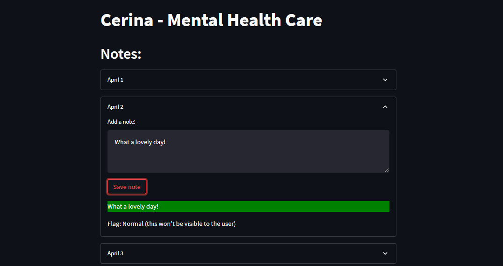

# Mental Health Application (ML-stack)

The solution includes a web-app tool designed to provide early intervention for individuals experiencing mental health challenges. The platform uses natural language processing and machine learning algorithms to analyze text input from users and provide personalized support and resources. In this report, we present an overview of the platform's features, the technology used to build it, and our findings from testing its effectiveness. We also discuss the potential impact of the model on the field of mental health care and the broader community.

#### `Web App Interface`

======
